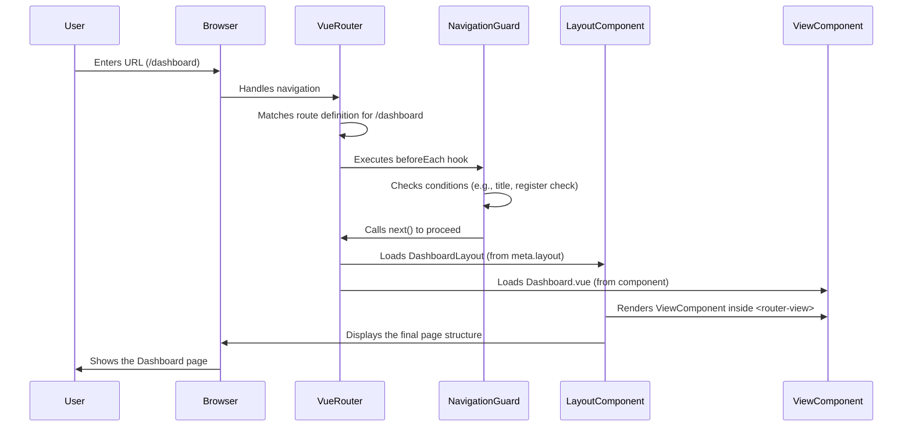

# Chapter 1: Routing and Layouts

Welcome to the TradeNote project! This is the very first chapter, and we'll start by understanding how you navigate around the application – like finding your way through a building. This concept is called **Routing and Layouts**.

Imagine you just opened the TradeNote app in your web browser. How does it know what to show you? If you type `/dashboard` in the address bar, how does it display the main dashboard screen? And why does the login page look different from the main dashboard page? That's what Routing and Layouts handle!

**What Problem Does This Solve?**

Think of a website or application like a building with many rooms.
*   **Routing** is like the building's directory. It lists all the room numbers (web addresses or URLs, like `/login` or `/dashboard`) and tells you what's inside each room (which specific screen or "view" to show).
*   **Layouts** are like the floor plans for different *areas* of the building. The lobby (login/register area) might have a simple, open layout. The office floors (main dashboard area) might have a different layout with hallways, shared kitchens (like sidebars or headers), and individual offices (the specific content area).

Routing and Layouts work together to:
1.  Figure out which "page" (View component) to show based on the URL you visit.
2.  Wrap that page in the correct overall structure (Layout).
3.  Sometimes, perform checks before letting you enter a "room" (like checking if registration is allowed).

**Core Concepts**

1.  **Routes:** A route is a specific path in the URL (like `/settings`) that maps to a specific part of your application.
2.  **Views:** A view is the main content for a specific route. In TradeNote (which uses Vue.js), views are typically Vue components (like `Settings.vue` or `Dashboard.vue`). They represent the "room" itself.
3.  **Layouts:** A layout is a container component that defines the general structure surrounding a view. It might include things like a navigation bar, a sidebar, or a footer. It's the "floor plan" for an area of the application.

**How TradeNote Uses Routing and Layouts**

TradeNote uses a popular library called `vue-router` to manage all this. Let's look at how it's set up in the file `src/router/index.js`.

**Defining the Routes**

The core of the router setup is defining a list of all possible routes. Here's a simplified example of one route definition:

```javascript
// src/router/index.js (simplified)
import DashboardLayout from '../layouts/Dashboard.vue'

const routes = [
  // ... other routes
  {
    path: '/dashboard', // The URL path
    name: 'dashboard',  // A unique name for this route
    meta: {             // Extra information about the route
      title: "Dashboard", // Text for the browser tab title
      layout: DashboardLayout // Which layout to use
    },
    // The main component to display for this route
    component: () => import('../views/Dashboard.vue')
  },
  // ... more routes
];
```

*   `path: '/dashboard'`: This means when you go to `your-tradenote-address.com/dashboard`, this route definition will be matched.
*   `name: 'dashboard'`: A handy nickname for this route, useful for linking between pages.
*   `meta: { ... }`: This object holds extra information.
    *   `title: "Dashboard"`: Sets the text you see in your browser tab.
    *   `layout: DashboardLayout`: This is crucial! It tells the application to wrap the `Dashboard.vue` view within the `DashboardLayout` component.
*   `component: () => import(...)`: This specifies *which* Vue component (the "view") should be displayed as the main content for this `/dashboard` route. The `import()` function helps load the component only when needed, which makes the app start faster.

**Choosing a Layout**

Notice that different routes can specify different layouts. For example, the login route might use `LoginRegisterLayout`, while the dashboard uses `DashboardLayout`.

```javascript
// src/router/index.js (simplified snippets)
import LoginRegisterLayout from '../layouts/LoginRegister.vue'
import DashboardLayout from '../layouts/Dashboard.vue'

const routes = [
 {
    path: '/', // Root path, often login
    name: 'login',
    meta: {
        title: "Login",
        layout: LoginRegisterLayout // Use the simple layout
    },
    component: () => import('../views/Login.vue')
 },
 {
    path: '/dashboard',
    name: 'dashboard',
    meta: {
        title: "Dashboard",
        layout: DashboardLayout // Use the main app layout
    },
    component: () => import('../views/Dashboard.vue')
 },
 // ... other routes
];
```

This allows the login page (`/`) to have a very simple structure (maybe just a centered box), while the dashboard (`/dashboard`) has a more complex structure with navigation menus, etc. The actual layout components (`LoginRegisterLayout.vue`, `DashboardLayout.vue`) contain the HTML structure and a special `<router-view></router-view>` tag where the specific view component (`Login.vue`, `Dashboard.vue`) gets inserted.

**Performing Checks Before Navigation (Navigation Guards)**

Sometimes, you need to check things before allowing a user to navigate to a page. `vue-router` lets us do this with "navigation guards". TradeNote uses one to potentially disable the registration page.

```javascript
// src/router/index.js (simplified)
import { registerOff } from '../stores/globals' // A global setting

// This function runs BEFORE every navigation attempt
router.beforeEach((to, from, next) => {
  // Set the browser tab title
  const title = to.meta.title
  if (title) {
    document.title = title
  }

  // Check: Is the user trying to go to 'register' AND is registration turned off?
  if (to.name === 'register' && registerOff.value) {
    // If yes, redirect them to the login page ('/') instead
    next('/')
  } else {
    // Otherwise, allow navigation to proceed as planned
    next()
  }
})
```

*   `router.beforeEach(...)`: This sets up a function that runs *before each* navigation happens.
*   `to`: Represents the route the user is trying to navigate *to*.
*   `from`: Represents the route the user is coming *from*.
*   `next()`: This function must be called to resolve the navigation. Calling `next()` allows the navigation, `next(false)` cancels it, and `next('/')` redirects to a different route (in this case, the login page).
*   `registerOff.value`: This is a global flag (managed by state management, see [Chapter 3: Global State Management (Pinia Stores)](03_global_state_management__pinia_stores__.md)) that indicates whether new user registration is currently disabled by the application's configuration.

So, if the server configuration says registration is off (`registerOff.value` is true), and a user tries to access `/register`, this guard redirects them back to the login page (`/`).

**How it Works Under the Hood**

Let's trace what happens when you type `your-tradenote-address.com/dashboard` into your browser:

1.  **Browser:** Sends the request.
2.  **Vue Router:** Intercepts the request within the TradeNote app (since it's a Single Page Application).
3.  **Route Matching:** `vue-router` looks through the `routes` array defined in `src/router/index.js`. It finds the entry where `path` is `/dashboard`.
4.  **Navigation Guard:** The `router.beforeEach` guard runs. It checks if the destination is `/register` (it's not) and sets the document title to "Dashboard". Since no redirection condition is met, it calls `next()`.
5.  **Layout Loading:** The matched route's `meta.layout` specifies `DashboardLayout`. The application loads and displays this layout component.
6.  **View Loading:** The route's `component` property specifies `() => import('../views/Dashboard.vue')`. The `Dashboard.vue` component is loaded.
7.  **Rendering:** The `DashboardLayout` component contains a `<router-view>` element. `vue-router` injects the loaded `Dashboard.vue` component into this `<router-view>`.
8.  **Display:** Your browser now shows the dashboard page, wrapped inside the structure defined by `DashboardLayout.vue`.

Here's a simplified diagram:



**Conclusion**

You've just learned the basics of Routing and Layouts in TradeNote! You now know:

*   How URLs like `/dashboard` or `/settings` map to specific Vue components (Views).
*   How Layout components (`DashboardLayout`, `LoginRegisterLayout`) provide a consistent structure for different sections of the app.
*   How `vue-router` uses the definitions in `src/router/index.js` to manage navigation.
*   How navigation guards (`router.beforeEach`) can add logic before a page loads, like checking if registration is allowed.

This system acts as the fundamental map and structure for the entire TradeNote application, guiding users to the right place and ensuring pages look consistent within their respective sections.

Next, we'll dive into how TradeNote gets your trading data into the system.

**Next Chapter:** [Chapter 2: Broker Data Import & Parsing](02_broker_data_import___parsing_.md)

---

Generated by [AI Codebase Knowledge Builder](https://github.com/The-Pocket/Tutorial-Codebase-Knowledge)