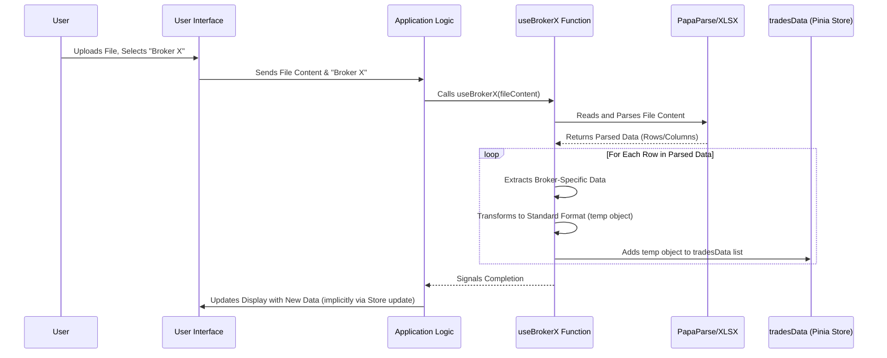

# Chapter 2: Broker Data Import & Parsing

In [Chapter 1: Routing and Layouts](01_routing_and_layouts_.md), we learned how TradeNote organizes its pages and navigation, like the floor plan of a building. Now that we know how to move around, we need something to *put* in those rooms – specifically, your trading data! This chapter explains how TradeNote gets your trade information from your broker into the application.

**What Problem Does This Solve?**

Imagine you trade using Interactive Brokers, while your friend uses Tradovate. When you both export your trade history, the files look completely different!
*   Interactive Brokers might give you a CSV file with column names like "Date/Time", "Buy/Sell", and "Quantity".
*   Tradovate might give you a different CSV with columns like "Fill Time", "B/S", and "Filled Qty".
*   MetaTrader 5 gives you an Excel/XML file!

How can TradeNote understand all these different formats? It would be like trying to read reports written in English, Spanish, and Japanese all at once without a translator.

This is where **Broker Data Import & Parsing** comes in. It acts like a **universal translator and data entry clerk** for TradeNote. Its job is to:
1.  Take the report file you download from your broker (in its specific "language" or format).
2.  Read and understand the information in that file.
3.  Translate and reformat that information into a single, consistent "language" that TradeNote understands.

This ensures that no matter which broker you use, your trades can be recorded and analyzed consistently within TradeNote.

**Core Concepts**

1.  **Raw Broker Data:** This is the file you download directly from your brokerage platform (like Interactive Brokers, Tradovate, MetaTrader 5, etc.). These files usually come in formats like CSV (Comma Separated Values, like a simple spreadsheet) or sometimes XML/Excel. Each broker has its own unique structure and column names for these files. You can find instructions on how to export these files for various brokers in the `brokers/README.md` file within the project.
2.  **Parsing Functions (`useBroker...`):** These are special JavaScript functions within TradeNote, located in the `src/utils/brokers.js` file. There's typically one function for each supported broker (e.g., `useBrokerInteractiveBrokers`, `useBrokerTradovate`, `useBrokerMetaTrader5`). Think of each function as a specialist translator fluent in one specific broker's "language". Its job is to read the raw file format of that *specific* broker.
3.  **Standardized Format (`tradesData`):** This is the common "language" that TradeNote uses internally to represent every single trade execution (a buy or a sell). It's essentially a list (an array) of simple objects, where each object represents one execution and always has the *same* set of properties (like `Account`, `T/D` (Trade Date), `Symbol`, `Side`, `Qty`, `Price`, `Comm` (Commission), `Exec Time`). This standardized list is stored using TradeNote's global state management system, which we'll cover in [Chapter 3: Global State Management (Pinia Stores)](03_global_state_management__pinia_stores__.md). The exact fields expected in this format are detailed in the `brokers/README.md` file under the "Template" section.

**How TradeNote Uses Import & Parsing**

Let's walk through what happens when you upload your trade history file:

1.  **Upload:** You go to the import section in TradeNote, select your broker (e.g., "Interactive Brokers") from a dropdown list, and choose the file you downloaded from your broker.
2.  **Identify & Call:** TradeNote sees you selected "Interactive Brokers" and knows it needs to use the `useBrokerInteractiveBrokers` function from `src/utils/brokers.js`. It calls this function, passing the content of your uploaded file to it.
3.  **Parse & Translate:** The `useBrokerInteractiveBrokers` function reads your file. It knows exactly which columns to look for ("Date/Time", "Buy/Sell", "Quantity", "Price", "Commission", etc.) because it was specifically written for Interactive Brokers' format. It extracts the data from each row.
4.  **Standardize:** For each row (representing one trade execution), the function creates a new, simple object that matches the standard `tradesData` format. It maps the broker's column names to TradeNote's standard names (e.g., "Date/Time" becomes `T/D` and `Exec Time`, "Buy/Sell" becomes `Side`, "Quantity" becomes `Qty`). It might also perform small adjustments, like making sure commissions are negative numbers or formatting dates correctly.
5.  **Store:** Each of these newly created standard trade objects is added to the main `tradesData` list, which is managed globally by [Chapter 3: Global State Management (Pinia Stores)](03_global_state_management__pinia_stores__.md).

Now, TradeNote has your trading data in a format it can easily use for display, calculations, and charting, regardless of which broker it originally came from!

**Internal Implementation: Under the Hood**

Let's peek behind the curtain at how this translation process works.

**Step-by-Step Walkthrough**

Imagine you upload a CSV file from "Broker X".

1.  **File Received:** The user interface gives the file content and the selected broker ("Broker X") to the core application logic.
2.  **Dispatcher:** The application logic looks up which function handles "Broker X" – let's say it's `useBrokerX`.
3.  **Function Call:** It calls `useBrokerX(fileContent)`.
4.  **Reading the File:** Inside `useBrokerX`, a library like `PapaParse` (for CSV files) or `XLSX` (for Excel files) is used to read the `fileContent` and break it down into rows and columns based on Broker X's specific format.
5.  **Iteration & Extraction:** The function loops through each row in the parsed file data. For each row, it pulls out the values it needs, using the column names specific to Broker X (e.g., `Trade_Date`, `Ticker`, `Action`, `Shares`, `Exec_Price`, `Fees`).
6.  **Transformation & Formatting:** It creates a new, empty object (`temp`). It then populates this object according to the standard `tradesData` format:
    *   `temp.Account = row.Account_ID`
    *   `temp['T/D'] = formatDate(row.Trade_Date)` // Format date to MM/DD/YYYY
    *   `temp['Exec Time'] = formatTime(row.Execution_Timestamp)` // Format time to HH:mm:ss
    *   `temp.Symbol = row.Ticker`
    *   `temp.Side = convertSide(row.Action)` // Convert "Buy" to "B", "Sell Short" to "SS", etc.
    *   `temp.Qty = Math.abs(row.Shares)` // Ensure quantity is positive
    *   `temp.Price = row.Exec_Price`
    *   `temp.Comm = -Math.abs(row.Fees)` // Ensure commission is negative
    *   ... (and other fields, setting defaults like 0 for fees if not applicable)
7.  **Storing:** This standardized `temp` object is added (`push`) to the global `tradesData` array.
8.  **Completion:** After processing all rows, the function signals success. The application now has the updated `tradesData` list.

**Sequence Diagram**

Here's a visual representation of the process:



**Code Snippets Example (`src/utils/brokers.js`)**

Let's look at a highly simplified example of what a part of a parsing function might look like. Imagine a very basic CSV format like this:

```csv
Date,Time,Symbol,Action,Quantity,Price,Commission
01/15/2024,09:35:02,AAPL,Buy,10,185.50,1.00
01/15/2024,10:10:15,AAPL,Sell,10,186.20,1.00
```

A simplified parser function (`useBrokerSimpleCSV`) might contain logic like this:

```javascript
// src/utils/brokers.js (Simplified Example)
import Papa from 'papaparse';
import { tradesData } from "../stores/globals.js"; // The global list

export async function useBrokerSimpleCSV(csvContent) {
  return new Promise(async (resolve, reject) => {
    try {
      // 1. Use PapaParse library to read the CSV string
      let parseResult = Papa.parse(csvContent, { header: true });
      let rows = parseResult.data;

      // 2. Loop through each row from the CSV
      rows.forEach(row => {
        // Skip empty rows potentially added by PapaParse
        if (row.Date && row.Symbol) {
          let temp = {}; // Create an empty standard object

          // 3. Map broker columns to standard 'tradesData' fields
          temp.Account = "MyAccount"; // Assume a default or get from elsewhere
          temp['T/D'] = row.Date;    // Already in MM/DD/YYYY format
          temp['S/D'] = row.Date;
          temp.Currency = "USD";
          temp.Type = "stock";     // Assume stock for simplicity

          // Convert 'Action' to standard 'Side'
          if (row.Action === "Buy") temp.Side = "B";
          else if (row.Action === "Sell") temp.Side = "S";
          // ... add logic for SS (Sell Short) and BC (Buy Cover) if needed

          temp.SymbolOriginal = row.Symbol; // Keep original symbol if needed
          temp.Symbol = row.Symbol;
          temp.Qty = row.Quantity;
          temp.Price = row.Price;
          temp['Exec Time'] = row.Time; // Already in HH:mm:ss format

          // Ensure commission is a negative number
          temp.Comm = (-Math.abs(parseFloat(row.Commission))).toString();

          // Set default values for other fields
          temp.SEC = "0"; temp.TAF = "0"; /* ... etc ... */
          temp["Gross Proceeds"] = calculateGrossProceeds(temp.Side, temp.Qty, temp.Price); // Placeholder for calculation
          temp["Net Proceeds"] = calculateNetProceeds(temp["Gross Proceeds"], temp.Comm); // Placeholder

          // 4. Add the standardized object to the global list
          tradesData.push(temp);
        }
      });
      resolve(); // Signal success
    } catch (error) {
      console.error("Error parsing CSV:", error);
      reject(error); // Signal failure
    }
  });
}

// Helper functions (placeholders)
function calculateGrossProceeds(side, qty, price) {
  const numQty = parseFloat(qty);
  const numPrice = parseFloat(price);
  if (side === 'B' || side === 'BC') {
    return (-numQty * numPrice).toString(); // Negative for buys
  } else {
    return (numQty * numPrice).toString(); // Positive for sells
  }
}

function calculateNetProceeds(gross, comm) {
    return (parseFloat(gross) + parseFloat(comm)).toString(); // Gross + Commission (which is negative)
}
```

*   **`import Papa from 'papaparse'`:** Imports the library needed to read CSV data. Other functions might use `import * as XLSX from 'xlsx';` for Excel files.
*   **`import { tradesData } ...`:** Imports the global list where standardized trades are stored (from the Pinia store discussed in Chapter 3).
*   **`Papa.parse(csvContent, { header: true })`:** Reads the file content. `header: true` tells it the first row contains column names.
*   **`rows.forEach(row => { ... })`:** Loops through each trade record found in the file.
*   **`let temp = {}`:** Creates a blank slate for the standardized trade object.
*   **`temp['T/D'] = row.Date;` etc.:** This is the core translation step – copying data from the broker's column (`row.Date`) to the standard field (`temp['T/D']`). Notice the logic to convert `Action` to `Side` and ensure `Comm` is negative.
*   **`tradesData.push(temp)`:** Adds the fully translated and standardized trade object to the global list.
*   **Helper Functions:** Real parsers often need helper functions for complex calculations like proceeds, date/time conversions, or identifying instrument types (stock, future, option).

Each `useBroker...` function in `src/utils/brokers.js` follows this same pattern but is tailored to the specific columns, data formats, and potential quirks of the broker it's designed for. Some brokers might require more complex logic to handle different instrument types (futures, options) or calculate fees correctly based on the symbol, referencing data stored in `globals.js` like `futureContractsJson`. You can also find user-contributed conversion scripts in `brokers/conversionScripts.md` which might offer different approaches for specific brokers.

**Conclusion**

You've now learned how TradeNote tackles the challenge of diverse broker data formats! You understand:

*   Why importing and parsing is necessary (brokers speak different "languages").
*   The roles of Raw Broker Data, Parsing Functions (`useBroker...`), and the Standardized Format (`tradesData`).
*   How the process works: identify broker -> call specific parser -> read file -> translate & standardize -> store in `tradesData`.
*   That `src/utils/brokers.js` contains the specific "translator" functions for each broker, using libraries like `PapaParse` or `XLSX`.

This import and parsing step is crucial because it prepares your raw data, making it usable for all the powerful analysis and journaling features within TradeNote.

But where does this standardized `tradesData` list actually live, and how does the rest of the application access it? That's what we'll cover next.

**Next Chapter:** [Chapter 3: Global State Management (Pinia Stores)](03_global_state_management__pinia_stores__.md)

---

Generated by [AI Codebase Knowledge Builder](https://github.com/The-Pocket/Tutorial-Codebase-Knowledge)