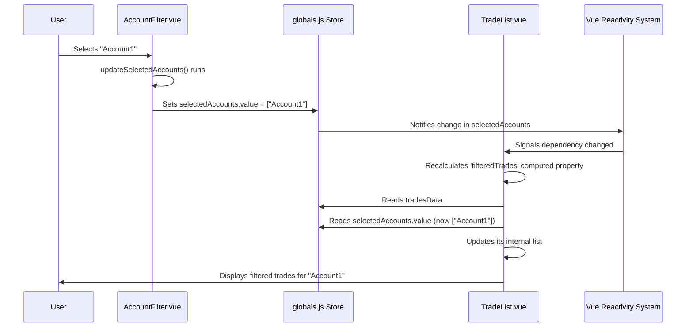

# Chapter 3: Global State Management (Pinia Stores)

In [Chapter 2: Broker Data Import & Parsing](02_broker_data_import___parsing_.md), we learned how TradeNote takes your trade history files and turns them into a standard format, the `tradesData` list. Great! But now, where does this list live so that different parts of the application (like the dashboard charts, the daily trade view, or filter menus) can all see and use it? And what about other shared information, like which date range you've selected, or your user profile?

**What Problem Does This Solve?**

Imagine you have a big whiteboard in the middle of an office. Different people need to write information on it (like upcoming deadlines or project updates) and read information from it. This whiteboard ensures everyone is looking at the same, up-to-date information.

In a web application like TradeNote, different components (like buttons, charts, tables, dropdown menus) are like the different people in the office. They often need access to the same pieces of data. For example:
*   A **Date Range Picker** component lets you choose dates.
*   A **Trade List** component needs to know the selected dates to show the correct trades.
*   A **Chart** component also needs the dates to display the relevant performance graph.

How do all these components share the selected date range? Passing the data manually from one component to another can become very messy and complicated, especially in a large application.

This is where **Global State Management** comes in. It provides a central place – like that shared whiteboard – to store data that needs to be accessed or modified by multiple components across the application. In TradeNote, this central place is managed using **Pinia Stores**.

**Core Concepts**

1.  **State:** This is just a fancy word for the data that describes the current situation of your application. Think of it as the information currently written on the whiteboard. Examples in TradeNote include: your user information, the list of imported trades (`tradesData`), the currently selected date range, which filters are active, whether a loading spinner should be showing, etc.
2.  **Global State:** This refers to state (data) that needs to be accessible from *anywhere* in the application, not just within a single component. The selected date range is a perfect example.
3.  **Pinia:** This is the specific library (a tool) that Vue.js applications like TradeNote use to manage global state. It makes creating and using these shared data "whiteboards" easy and efficient.
4.  **Store (Pinia Store):** A "store" in Pinia is like a specific section *on* the whiteboard, dedicated to a particular category of information. You might have one store for user settings, another for trade data, etc. In TradeNote, we keep things simple for now and use one main store for most global data.
5.  **`src/stores/globals.js`:** This is the key file in TradeNote that defines our main Pinia store. Think of it as the *actual* whiteboard where we list all the shared pieces of information the application needs. It holds things like `currentUser`, `selectedDateRange`, `tradesData`, `spinnerLoadingPage`, and many others.
6.  **Reactivity:** This is a crucial concept. When data in a Pinia store changes (e.g., you select a new date range), any component using that data automatically *reacts* and updates itself without needing manual instructions. The whiteboard magically updates itself for everyone watching!

**How TradeNote Uses Pinia Stores**

TradeNote centralizes most of its shared data in the `src/stores/globals.js` file. Let's see how it works.

**1. Defining the State (`src/stores/globals.js`)**

Inside this file, we define various pieces of state using functions like `ref` and `reactive` provided by Vue.js (which Pinia uses internally).

```javascript
// src/stores/globals.js (Simplified Snippet)
import { ref, reactive } from "vue";

// The list of trades standardized in Chapter 2
export const tradesData = reactive([]);

// Example: User's selected filter for accounts
// ref() is often used for simple values (string, number, boolean)
export const selectedAccounts = ref([]); // Starts as an empty list

// Example: Is the main page loading?
export const spinnerLoadingPage = ref(true); // Starts as true

// Example: User's profile information
// reactive() is often used for objects
export const currentUser = reactive({ name: null, email: null });

// ... many other global state variables ...
```

*   `import { ref, reactive } from "vue";`: We import tools from Vue to make our data reactive.
*   `export const tradesData = reactive([]);`: We create an empty list called `tradesData`. `reactive` makes the *entire list* reactive (if you add/remove items, components will update). We use `export` so other files can import and use it. This is where the data from [Chapter 2: Broker Data Import & Parsing](02_broker_data_import___parsing_.md) gets stored.
*   `export const selectedAccounts = ref([]);`: We create a variable `selectedAccounts` using `ref`. `ref` is typically used for single values (like numbers, strings, booleans) or simple arrays. It wraps the value in a special object. We start it as an empty array `[]`.
*   `export const spinnerLoadingPage = ref(true);`: A boolean flag to show/hide a loading spinner, initially set to `true`.

**2. Using the State in a Component (Reading)**

Now, imagine a component that needs to display trades based on the selected accounts. It needs to *read* both `tradesData` and `selectedAccounts` from the store.

```vue
<!-- Simplified Example Component: TradeList.vue -->
<template>
  <div>
    <p>Showing trades for accounts: {{ selectedAccounts.join(', ') || 'All' }}</p>
    <ul>
      <!-- Loop through tradesData (potentially filtered) -->
      <li v-for="trade in filteredTrades" :key="trade.id">
        {{ trade.Symbol }} - {{ trade.Side }} {{ trade.Qty }} @ {{ trade.Price }}
      </li>
    </ul>
    <div v-if="isLoading">Loading...</div>
  </div>
</template>

<script setup>
import { computed } from 'vue';
// 1. Import the state we need from the store
import { tradesData, selectedAccounts, spinnerLoadingPage } from '@/stores/globals.js';

// 2. Use the imported state directly in the template or computed properties
const isLoading = computed(() => spinnerLoadingPage.value);

// Example: Filter trades based on selected accounts (simplified)
const filteredTrades = computed(() => {
  if (!selectedAccounts.value || selectedAccounts.value.length === 0) {
    return tradesData; // Show all if no accounts selected
  }
  return tradesData.filter(trade => selectedAccounts.value.includes(trade.Account));
});

// We can access the value inside 'ref' using .value in script
console.log('Current selected accounts:', selectedAccounts.value);
</script>
```

*   `import { ... } from '@/stores/globals.js';`: We import the specific pieces of state we need directly from our `globals.js` store file.
*   `selectedAccounts`: In the `<template>`, Vue automatically understands `ref` and `reactive`, so we can use `selectedAccounts` directly.
*   `spinnerLoadingPage.value`: In the `<script setup>` block, when we use a variable created with `ref` (like `spinnerLoadingPage` or `selectedAccounts`), we need to access its actual value using `.value`.
*   `tradesData`: Since `tradesData` was defined with `reactive`, we can often use it directly in the script without `.value` (though accessing properties might be needed depending on the structure).
*   `computed(...)`: This is a Vue feature that creates a value based on other reactive state. It automatically recalculates if `tradesData` or `selectedAccounts.value` changes.

**3. Updating the State in a Component (Writing)**

Now, let's imagine a filter component that lets the user select accounts. When the user makes a selection, this component needs to *update* the `selectedAccounts` in the store.

```vue
<!-- Simplified Example Component: AccountFilter.vue -->
<template>
  <div>
    <label>Filter by Account:</label>
    <!-- This selector updates the selectedAccounts in the store -->
    <select multiple @change="updateSelectedAccounts">
      <option value="Account1">Account 1</option>
      <option value="Account2">Account 2</option>
      <option value="Account3">Account 3</option>
      <!-- Add more options as needed -->
    </select>
  </div>
</template>

<script setup>
// 1. Import the state we need to modify
import { selectedAccounts } from '@/stores/globals.js';

// 2. Function to update the store state
function updateSelectedAccounts(event) {
  // Get the selected options from the event
  const selectedOptions = Array.from(event.target.selectedOptions).map(option => option.value);

  // 3. Assign the new value using .value
  selectedAccounts.value = selectedOptions;

  console.log('Updated selected accounts in store to:', selectedAccounts.value);
}
</script>
```

*   `import { selectedAccounts } from '@/stores/globals.js';`: Again, we import the state we want to change.
*   `selectedAccounts.value = selectedOptions;`: This is the key line! We assign the new array of selected account names directly to `selectedAccounts.value`. Because `selectedAccounts` is reactive and managed by Pinia, this change is instantly broadcast. Any other component using `selectedAccounts` (like our `TradeList.vue` example) will automatically react and update its display.

**Internal Implementation: Under the Hood**

How does Pinia make this work so seamlessly?

**Step-by-Step Walkthrough**

Let's trace the flow when the user selects "Account1" in the `AccountFilter.vue` component:

1.  **User Interaction:** The user clicks on "Account1" in the dropdown.
2.  **Event Triggered:** The `@change` event fires on the `<select>` element.
3.  **Update Function:** The `updateSelectedAccounts` function in `AccountFilter.vue` runs.
4.  **Get New Value:** The function reads the selected options and creates `selectedOptions = ["Account1"]`.
5.  **Store Update:** The line `selectedAccounts.value = ["Account1"];` executes.
6.  **Pinia Magic:** Pinia detects that the `selectedAccounts` state in the `globals.js` store has changed.
7.  **Notification:** Pinia notifies all parts of the application that are currently "subscribed" to (using) `selectedAccounts`.
8.  **Component Reaction:**
    *   `AccountFilter.vue` might update its display if needed (though in this simple example, it doesn't need to).
    *   `TradeList.vue` receives the notification. Its `filteredTrades` computed property depends on `selectedAccounts.value`.
9.  **Re-computation:** The `filteredTrades` computed property automatically recalculates using the new value `["Account1"]`. It filters `tradesData` and returns only trades matching "Account1".
10. **DOM Update:** Vue efficiently updates the part of the web page managed by `TradeList.vue` to show only the newly filtered list of trades.

**Sequence Diagram**



**Code Structure (`src/stores/globals.js`)**

The actual `globals.js` file is essentially a collection of exported `ref` and `reactive` variables.

```javascript
// src/stores/globals.js (Structure Example)
import { ref, reactive } from "vue";

// --- Filters & Selections ---
export const selectedAccounts = ref([]); // For account filter dropdown
export const selectedTags = ref([]); // For tag filter
export const selectedDateRange = ref(null); // For the date picker

// --- Core Data ---
export const tradesData = reactive([]); // Holds standardized trades from Chapter 2
export const currentUser = reactive({ /* user details */ }); // Logged-in user info

// --- UI State ---
export const spinnerLoadingPage = ref(true); // Show/hide loading spinner
export const modalDailyTradeOpen = ref(false); // Is the trade details modal open?
export const sideMenuMobileOut = ref(false); // Is the mobile menu visible?

// --- Configuration ---
export const timeZones = ref(["America/New_York", /* ... */]); // List of timezones
export const futureContractsJson = ref([ /* ... contract details ... */ ]); // Futures contract specs used in parsing/calculations

// ... and many more ...
```

This structure makes it easy to find and manage different pieces of global information. Other parts of the application simply `import` the specific variables they need. Pinia, integrated when the Vue app starts (usually in `src/main.js`), handles the underlying mechanics of tracking changes and notifying components.

**Conclusion**

You've now learned about the "shared whiteboard" of the TradeNote application: Global State Management using Pinia Stores!

*   You understand **why** it's needed: to share data easily across many components.
*   You know the core concepts: **State**, **Pinia**, **Store**, and **Reactivity**.
*   You've seen that **`src/stores/globals.js`** is TradeNote's central store.
*   You learned how components can **read** state (importing and using `.value` for `ref`) and **write** state (importing and assigning to `.value` for `ref`).
*   You understand that Pinia makes these changes **reactive**, automatically updating any component that uses the changed data.

This central store is the heart of the application's data flow, connecting user actions (like selecting filters) to data displays (like charts and lists) and holding essential information like the imported `tradesData`.

Now that we have our trade data imported (Chapter 2) and stored globally (Chapter 3), how do we actually process and analyze this data to calculate things like daily P&L, group trades, and prepare it for charting? That's up next!

**Next Chapter:** [Chapter 4: Trade Data Processing & Aggregation](04_trade_data_processing___aggregation_.md)

---

Generated by [AI Codebase Knowledge Builder](https://github.com/The-Pocket/Tutorial-Codebase-Knowledge)