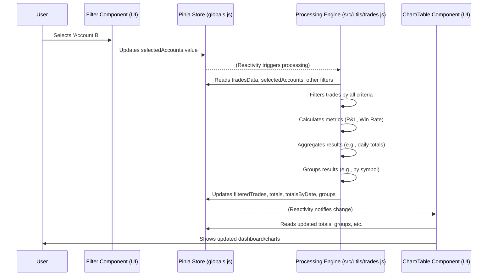

# Chapter 4: Trade Data Processing & Aggregation

In [Chapter 3: Global State Management (Pinia Stores)](03_global_state_management__pinia_stores__.md), we learned how TradeNote uses a central "whiteboard" (`src/stores/globals.js`) to store important information like the raw list of your imported trades (`tradesData`) and your filter selections (like chosen dates or accounts).

But just having a list of raw trades isn't very useful for analysis, right? You want to see your profits, understand your win rate, and see how different strategies or symbols are performing.

**What Problem Does This Solve?**

Imagine you have a big spreadsheet filled with every single buy and sell you've ever made (this is like our `tradesData`). Now, you ask yourself:
*   "How much money did I make or lose *last week*?"
*   "What was my win rate for *only* my AAPL trades?"
*   "Show me my performance grouped by the *tags* I assigned, like 'Breakout' or 'Scalp'."

Doing these calculations manually by sifting through the raw spreadsheet would be tedious and error-prone!

This is where **Trade Data Processing & Aggregation** comes in. Think of it as the **analytical engine** or the "brain" of TradeNote. Its job is to:
1.  Take the raw `tradesData` list from the global store.
2.  Look at the filters you've selected (also from the store, like dates, accounts, tags).
3.  **Filter** the raw data to only include the trades that match your selections.
4.  **Calculate** important performance numbers (like Profit & Loss (P&L), win rates, trade duration) for those filtered trades.
5.  **Aggregate** (summarize) this information over different time periods (like daily totals, weekly totals, monthly totals).
6.  **Group** the results based on different criteria (like by stock symbol, by strategy, by tag) so you can compare performance across categories.

Essentially, this engine turns your raw data into meaningful insights that can be displayed in dashboards and reports.

**Core Concepts**

1.  **Filtering:** Picking out specific trades from the main `tradesData` list based on criteria you select in the user interface (UI). Common filters include:
    *   Date Range (e.g., "Last 7 Days", "This Month", or a custom range).
    *   Trading Account(s) (if you have multiple).
    *   Tags you've assigned to trades (e.g., "Momentum", "Reversal").
    *   Position Type (Long or Short).
2.  **Calculation:** Performing mathematical operations on the filtered trade data to figure out performance. Examples include:
    *   **Profit & Loss (P&L):** Calculating the gain or loss for each individual trade and summing them up.
    *   **Win Rate:** Calculating the percentage of trades that were profitable.
    *   **Average Win/Loss:** Finding the average P&L for winning trades and losing trades separately.
    *   **Trade Duration:** Calculating how long each trade lasted (time between entry and exit).
3.  **Aggregation:** Combining individual data points into summaries. For example, calculating the total P&L for each *day*, then summing those daily totals to get a *weekly* total.
4.  **Grouping:** Organizing the calculated and aggregated results into categories for easier comparison. You might group performance data by:
    *   Stock Symbol (e.g., performance for AAPL vs. TSLA).
    *   Strategy (e.g., performance for "Breakout" trades vs. "Mean Reversion" trades).
    *   Tags (performance grouped by your custom tags).
    *   Time of Day (performance during the morning vs. afternoon).
    *   Trade Duration (performance of short trades vs. long trades).

**How TradeNote Uses Processing & Aggregation**

This whole process usually kicks off when you change a filter in the UI or when new data is imported. It's mainly handled by functions within the `src/utils/trades.js` file.

Let's follow the journey:

1.  **Trigger:** You select a new date range using the date picker component in the TradeNote UI.
2.  **Store Update:** The date picker component updates the `selectedDateRange` variable in the [Global State Management (Pinia Stores)](03_global_state_management__pinia_stores__.md).
3.  **Reactivity:** Vue.js detects that `selectedDateRange` has changed. This triggers a function responsible for reprocessing the trade data (let's call it the "Processing Engine", often involving `useGetFilteredTrades` from `src/utils/trades.js`).
4.  **Input Gathering:** The Processing Engine reads the *latest* filter values from the store:
    *   The new `selectedDateRange`.
    *   The current `selectedAccounts`, `selectedTags`, `selectedPositions`.
    *   The full list of raw `tradesData`.
5.  **Filtering (`useGetFilteredTrades`):** The engine iterates through the raw `tradesData` and keeps only the trades that fall within the `selectedDateRange` AND match the `selectedAccounts` AND match the `selectedTags`, etc.
    ```javascript
    // Simplified concept: Filtering logic inside useGetFilteredTrades
    let rawTrades = tradesData; // From Pinia Store
    let dateRange = selectedDateRange.value; // From Pinia Store
    let accounts = selectedAccounts.value; // From Pinia Store
    let tags = selectedTags.value; // From Pinia Store

    let currentlyFilteredTrades = [];

    rawTrades.forEach(trade => {
      // Check if trade matches ALL selected filters
      let dateMatch = trade.dateUnix >= dateRange.start && trade.dateUnix < dateRange.end;
      let accountMatch = accounts.length === 0 || accounts.includes(trade.account);
      // Tag matching is more complex, involving checks against assigned tags...
      let tagMatch = checkTradeTagMatch(trade, tags); // Placeholder for tag logic

      if (dateMatch && accountMatch && tagMatch /* && other filters */) {
        currentlyFilteredTrades.push(trade);
      }
    });
    // Result: currentlyFilteredTrades contains only trades matching the filters.
    ```
6.  **Calculation & P&L (`useCreatePnL`, `useTotalTrades`):** The engine then processes these `currentlyFilteredTrades`. It might link buy and sell executions together to form complete trades and calculate the P&L for each one. It then calculates overall totals (like total P&L, total wins, total losses) for the entire filtered set.
    ```javascript
    // Simplified concept: Calculating totals inside useTotalTrades
    let totalNetPnl = 0;
    let winCount = 0;
    let lossCount = 0;

    currentlyFilteredTrades.forEach(trade => {
      // Assume P&L calculation happened earlier or is done here
      let tradePnl = calculateTradePnl(trade); // Placeholder
      totalNetPnl += tradePnl;

      if (tradePnl > 0) {
        winCount++;
      } else if (tradePnl < 0) {
        lossCount++;
      }
    });

    let overallTotals = {
      netProceeds: totalNetPnl,
      netWinsCount: winCount,
      netLossCount: lossCount,
      trades: currentlyFilteredTrades.length,
      // ... other calculated totals (avg win, avg loss, win rate, etc.)
    };
    ```
7.  **Aggregation (`useTotalTrades`):** It aggregates results by date, calculating daily totals for P&L, number of trades, etc.
    ```javascript
    // Simplified concept: Aggregating by date inside useTotalTrades
    // Using Lodash library for grouping
    let tradesGroupedByDate = _.groupBy(currentlyFilteredTrades, 'dateUnix');

    let dailyTotals = {};
    for (const dateUnix in tradesGroupedByDate) {
      let dailyPnl = 0;
      let dailyTradeCount = tradesGroupedByDate[dateUnix].length;
      tradesGroupedByDate[dateUnix].forEach(trade => {
        dailyPnl += calculateTradePnl(trade); // Placeholder
      });
      dailyTotals[dateUnix] = {
        netProceeds: dailyPnl,
        trades: dailyTradeCount,
        // ... other daily metrics
      };
    }
    // Result: dailyTotals object has metrics summarized for each day.
    ```
8.  **Grouping (`useGroupTrades`):** The engine groups the filtered trades by different criteria (symbol, duration, tags, etc.) to allow for category-based analysis.
    ```javascript
    // Simplified concept: Grouping by symbol inside useGroupTrades
    // Using Lodash library for grouping
    let tradesGroupedBySymbol = _.groupBy(currentlyFilteredTrades, 'symbol');
    let tradesGroupedByTag = groupTradesByAssignedTags(currentlyFilteredTrades); // Placeholder
    let tradesGroupedByDuration = groupTradesByDuration(currentlyFilteredTrades); // Placeholder

    let groupedResults = {
      symbols: tradesGroupedBySymbol,
      tags: tradesGroupedByTag,
      duration: tradesGroupedByDuration,
      // ... other groupings
    };
    ```
9.  **Store Update:** The Processing Engine takes all these calculated results (the filtered list, the overall totals, the daily totals, the grouped data) and updates the corresponding reactive variables in the [Global State Management (Pinia Stores)](03_global_state_management__pinia_stores__.md):
    *   `filteredTrades`: Updated with `currentlyFilteredTrades`.
    *   `totals`: Updated with `overallTotals`.
    *   `totalsByDate`: Updated with `dailyTotals`.
    *   `groups`: Updated with `groupedResults`.
    *   `profitAnalysis`: Updated with advanced metrics.
10. **UI Update:** Components that depend on these store variables (like charts in [Chapter 5: Charting & Visualization (ECharts)](05_charting___visualization__echarts__.md) or tables showing daily P&L) automatically react to the changes and redraw themselves with the new, processed information.

**Internal Implementation: Under the Hood**

Let's visualize the flow when you change a filter.

**Step-by-Step Walkthrough**

1.  **User Action:** You click on the "Account B" checkbox in a filter panel.
2.  **UI Component:** The filter panel component detects the click.
3.  **Store Write:** It updates the `selectedAccounts` variable in the `globals.js` store, maybe changing it from `['Account A']` to `['Account A', 'Account B']`.
4.  **Reactivity Trigger:** Vue's reactivity system notices the change in `selectedAccounts`.
5.  **Processing Starts:** This change triggers the main processing function (e.g., `useRefreshTrades` which calls `useGetFilteredTrades` and subsequent functions in `src/utils/trades.js`).
6.  **Read Filters & Data:** The processing function reads the *new* `selectedAccounts` (`['Account A', 'Account B']`), the existing `selectedDateRange`, `selectedTags`, and the full `tradesData` list from the store.
7.  **Filter Data:** It goes through `tradesData`, keeping only trades that match the date range AND belong to *either* 'Account A' OR 'Account B' AND match any selected tags.
8.  **Calculate, Aggregate, Group:** It performs all the calculations (P&L, etc.), aggregations (daily totals), and groupings (by symbol, tag, etc.) on this newly filtered set of trades.
9.  **Store Write (Update Results):** It updates the `filteredTrades`, `totals`, `totalsByDate`, and `groups` variables in the `globals.js` store with the fresh results.
10. **UI Reaction:** Dashboard components, charts, and tables that are displaying data based on `filteredTrades`, `totals`, or `groups` detect the changes in the store.
11. **Display Update:** These components automatically re-render to show the updated performance metrics reflecting trades from both 'Account A' and 'Account B'.

**Sequence Diagram**



**Code Structure (`src/utils/trades.js`)**

The file `src/utils/trades.js` contains the core logic. Key functions involved are:

*   **`useGetFilteredTrades(param)`:** This is a central function. It takes the raw trades (often fetched first by `useGetTrades`) and applies the filters currently set in the global store (`selectedDateRange`, `selectedAccounts`, `selectedTags`, `selectedPositions`). It iterates through trades and builds the `filteredTrades` array in the store. It also coordinates calling subsequent functions like `useCreateBlotter`, `useCreatePnL`.

    ```javascript
    // src/utils/trades.js (Conceptual Snippet inside useGetFilteredTrades)

    // 1. Get raw trades (potentially fetched earlier) and current filters
    const allTrades = trades; // Assumes 'trades' holds raw data
    const range = selectedRange.value;
    const accounts = selectedAccounts.value;
    const tagsFilter = selectedTags.value;
    const positionsFilter = selectedPositions.value;

    // 2. Clear previous results and filter
    filteredTrades.length = 0; // Clear the array in the store
    allTrades.forEach(dayData => {
        if (dayData.trades) {
            let filteredDayTrades = [];
            dayData.trades.forEach(trade => {
                // Apply all filters...
                const dateMatch = trade.td >= range.start && trade.td < range.end;
                const accountMatch = accounts.includes(trade.account);
                const tagMatch = checkTradeTagMatch(trade, tagsFilter); // Complex logic here
                const positionMatch = positionsFilter.includes(trade.strategy);

                if (dateMatch && accountMatch && tagMatch && positionMatch) {
                    filteredDayTrades.push(trade);
                }
            });
            // If any trades matched for this day, add them back (simplified structure)
            if (filteredDayTrades.length > 0) {
                 // Reconstruct daily data structure and push to filteredTrades
                 let tempDay = { ...dayData, trades: filteredDayTrades };
                 filteredTrades.push(tempDay);
            }
        }
    });

    // 3. Trigger further calculations on the now filtered 'filteredTrades'
    await useCreateBlotter(true); // Calculates blotter entries
    await useCreatePnL();       // Calculates P&L based on blotter
    // ... other calculation/aggregation calls ...
    ```

*   **`useTotalTrades()`:** After filtering, this function iterates through the `filteredTrades` (specifically the individual trades within each day's data). It calculates overall summary statistics (total P&L, total trades, total commissions, average win/loss, win rates, etc.) and stores them in the `totals` object in the global store. It also calculates these totals aggregated by date and stores them in `totalsByDate`.

    ```javascript
    // src/utils/trades.js (Conceptual Snippet inside useTotalTrades)
    let tempTotals = { /* Initialize all total counters to 0 */ };
    let tempDailyTotals = {};

    filteredTrades.forEach(dayData => { // Iterate through filtered days
        let dailyPnl = 0;
        dayData.trades.forEach(trade => { // Iterate through trades within the day
            // Accumulate overall totals
            tempTotals.netProceeds += trade.netProceeds;
            tempTotals.netWinsCount += trade.netWinsCount;
            // ... accumulate all other totals ...

            // Accumulate daily totals
            dailyPnl += trade.netProceeds;
        });
         // Store daily totals
         tempDailyTotals[dayData.dateUnix] = { netProceeds: dailyPnl, /* ... */ };
    });

    // Update the global store objects
    Object.assign(totals, tempTotals);
    Object.assign(totalsByDate, tempDailyTotals);
    ```

*   **`useGroupTrades()`:** This function takes the list of individual filtered trades (extracted from `filteredTrades`) and uses libraries like Lodash (`_`) to group them based on various properties like symbol (`_.groupBy(tradesList, 'symbol')`), entry time frame, duration, tags, etc. The results are stored in the `groups` object in the global store.

    ```javascript
    // src/utils/trades.js (Conceptual Snippet inside useGroupTrades)
    let allFilteredIndividualTrades = [];
    filteredTrades.forEach(day => allFilteredIndividualTrades.push(...day.trades));

    // Use Lodash groupBy for simple grouping
    groups.symbols = _.groupBy(allFilteredIndividualTrades, 'symbol');
    groups.position = _.groupBy(allFilteredIndividualTrades, 'strategy');

    // More complex grouping logic for timeframes, duration, tags...
    groups.timeframe = groupTradesByEntryTimeframe(allFilteredIndividualTrades);
    groups.duration = groupTradesByDuration(allFilteredIndividualTrades);
    groups.tags = groupTradesByAssignedTags(allFilteredIndividualTrades);
    // ... other groupings ...
    ```

*   **`useCalculateProfitAnalysis()`:** Calculates more advanced metrics like Risk/Reward ratios (R-multiples), potentially considering Maximum Favorable Excursion (MFE) data if available, and stores them in `profitAnalysis`.

These functions work together, triggered by changes in filters, to process the raw data and populate the global store with structured, calculated, and aggregated information ready for display.

**Conclusion**

You've now explored the "brain" of TradeNote – the Trade Data Processing & Aggregation engine!

*   You understand **why** it's essential: raw trade data needs processing to become useful analysis.
*   You learned the key steps: **Filtering**, **Calculating**, **Aggregating**, and **Grouping**.
*   You saw how user actions (like changing filters) trigger this engine via **Reactivity** and the [Global State Management (Pinia Stores)](03_global_state_management__pinia_stores__.md).
*   You know that functions in **`src/utils/trades.js`** (like `useGetFilteredTrades`, `useTotalTrades`, `useGroupTrades`) perform these tasks.
*   You understand that the **output** of this engine is stored back into reactive variables in the global store (`filteredTrades`, `totals`, `totalsByDate`, `groups`) for other parts of the app to use.

This processing engine transforms your basic trade list into powerful insights. But how do we visually represent these insights? How are those nice charts and graphs generated? That's what we'll cover next!

**Next Chapter:** [Chapter 5: Charting & Visualization (ECharts)](05_charting___visualization__echarts__.md)

---

Generated by [AI Codebase Knowledge Builder](https://github.com/The-Pocket/Tutorial-Codebase-Knowledge)