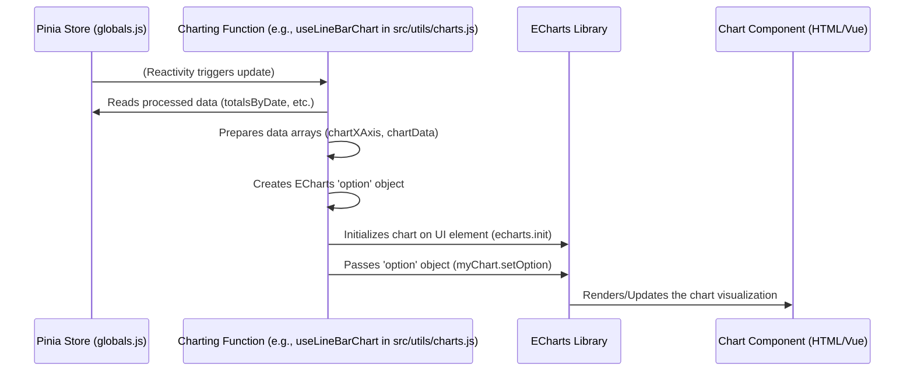

# Chapter 5: Charting & Visualization (ECharts)

In [Chapter 4: Trade Data Processing & Aggregation](04_trade_data_processing___aggregation_.md), we learned how TradeNote acts like an analytical engine, taking your raw trade data and turning it into meaningful statistics like daily profits, win rates, and grouped performance summaries. These calculated results (`totals`, `totalsByDate`, `groups`, etc.) are stored in our central "whiteboard", the [Global State Management (Pinia Stores)](03_global_state_management__pinia_stores__.md).

But numbers in a table can sometimes be hard to grasp quickly. How can you easily *see* the trends, patterns, and overall picture of your trading performance?

**What Problem Does This Solve?**

Imagine the Processing Engine (Chapter 4) just handed you a detailed report with lots of numbers about your trading last month. It tells you your total profit, your win rate, and how much you made each day. That's great information, but wouldn't it be easier to understand if you could see it visually?
*   A line chart showing your cumulative profit growing (or shrinking!) over the month.
*   A bar chart comparing the performance of different strategies or symbols.
*   A pie chart showing the percentage of winning vs. losing trades.

This is where **Charting & Visualization** comes in. Think of this part of TradeNote as the **Graphic Design Department**. Its job is to:
1.  Take the processed data and statistics (like `totalsByDate` or `groups`) from the global store.
2.  Use a powerful charting library called **ECharts** to turn that data into visual graphs and charts.
3.  Display these charts in the user interface, making it much easier for you to understand your trading performance and patterns at a glance.

It transforms lists of numbers into insightful pictures!

**Core Concepts**

1.  **ECharts:** A popular and powerful open-source JavaScript library used for creating a wide variety of interactive charts and graphs. TradeNote uses it as the engine to draw all the visualizations.
2.  **Chart Types:** Different ways to visualize data. TradeNote uses ECharts to create several types:
    *   **Line Chart:** Shows trends over time (e.g., cumulative P&L).
    *   **Bar Chart:** Compares values across categories (e.g., P&L per symbol, P&L per day).
    *   **Pie Chart:** Shows proportions of a whole (e.g., win rate percentage).
    *   **Candlestick Chart:** Specifically used in the Daily view to show price action (Open, High, Low, Close) for a given period, often with trade entry/exit markers.
    *   **Scatter Chart:** Shows the relationship between two variables, often using dot size to represent a third variable (e.g., plotting trades by entry time vs. P&L per share, with dot size representing total P&L).
    *   **Box Plot Chart:** Summarizes the distribution of data (e.g., showing the range and median of P&L per share for different days or weeks).
3.  **Data Preparation:** Before ECharts can draw a chart, the data from the global store (like `totalsByDate`) needs to be formatted specifically for the chart type. For example, a line chart needs a list of X-axis points (like dates) and a corresponding list of Y-axis values (like cumulative P&L).
4.  **Chart Options:** These are configuration settings passed to ECharts to tell it *how* to draw the chart. This includes things like chart type, data series, colors, titles, axis labels, tooltips (what shows when you hover), and legends.

**How TradeNote Uses Charting & Visualization**

The charting process is usually triggered when the processed data in the [Global State Management (Pinia Stores)](03_global_state_management__pinia_stores__.md) changes (e.g., after you change a filter and the [Trade Data Processing & Aggregation](04_trade_data_processing___aggregation_.md) engine recalculates everything).

Here's the typical flow:

1.  **Data Ready:** The Processing Engine finishes its job (Chapter 4) and updates variables like `totalsByDate`, `totals`, and `groups` in the global store (`src/stores/globals.js`).
2.  **Component Reacts:** A Vue component that displays a chart (e.g., a dashboard widget) is using this data from the store. Because the store data is reactive, the component notices the change.
3.  **Call Charting Function:** The component often calls a specific function from `src/utils/charts.js`. For example, if it needs to update the main P&L chart, it might call `useLineBarChart('lineBarChart1')`.
4.  **Prepare Data & Options:** Inside `useLineBarChart` (or another charting function like `usePieChart`, `useBarChart`, `useCandlestickChart`):
    *   It reads the necessary processed data (e.g., `totalsByDate`, `selectedTimeFrame`) from the global store.
    *   It loops through the data, extracting and formatting it into arrays suitable for ECharts (e.g., `chartXAxis`, `chartData`, `chartBarData`).
    *   It defines the ECharts `option` object, specifying the chart type, the prepared data arrays, colors, labels, tooltips, etc.
5.  **Initialize & Render:** The charting function gets the HTML element where the chart should be drawn (using its ID, like `lineBarChart1`). It initializes an ECharts instance on that element and passes the `option` object to it using `myChart.setOption(option)`.
6.  **Display:** ECharts takes the options and data and draws the chart in the browser for you to see.

**Internal Implementation: Under the Hood**

Let's see how this works when the processed data changes and a chart needs to update.

**Step-by-Step Walkthrough**

1.  **Store Update (Processed Data):** The `totalsByDate` object in `src/stores/globals.js` is updated by the processing engine (Chapter 4) after you change a date filter.
2.  **Reactivity Trigger:** Vue components using `totalsByDate` are notified.
3.  **Charting Function Call:** A dashboard component triggers the relevant charting function, say `useLineBarChart('lineBarChart1')`.
4.  **Read Data:** Inside `useLineBarChart`, it reads the fresh `totalsByDate` and other relevant settings like `selectedTimeFrame` and `amountCase` (Gross/Net) from the global store.
5.  **Data Loop & Formatting:** The function iterates through the `totalsByDate` object. For each date (or week/month depending on `selectedTimeFrame`):
    *   It calculates the P&L for that period.
    *   It calculates the cumulative P&L up to that period.
    *   It formats the date/period label.
    *   It pushes the formatted label into the `chartXAxis` array.
    *   It pushes the period's P&L into the `chartBarData` array.
    *   It pushes the cumulative P&L into the `chartData` (for the line) array.
6.  **Define Options:** It creates the `option` object, configuring:
    *   `xAxis`: Uses the `chartXAxis` array.
    *   `yAxis`: Configures labels (e.g., currency format).
    *   `series`: Defines two series: one of type `'line'` using `chartData`, and one of type `'bar'` using `chartBarData`. Sets colors, smoothing, etc.
    *   `tooltip`: Configures what appears when you hover over the chart.
7.  **Find Element:** It finds the `<div id="lineBarChart1"></div>` in the HTML.
8.  **ECharts Render:** It calls `echarts.init()` on the div and then `myChart.setOption(option)`. ECharts clears any old chart and draws the new one based on the provided data and options.
9.  **UI Update:** The chart appears or updates on your screen.

**Sequence Diagram**

This diagram shows the flow starting from when processed data is updated in the store:



**Code Snippets (`src/utils/charts.js`)**

Let's look at a *highly simplified* version of how `useLineBarChart` might prepare data for the main P&L chart showing daily results.

```javascript
// src/utils/charts.js (Simplified Example)
import * as echarts from 'echarts';
import dayjs from 'dayjs';
// Import necessary state from the global store
import { totalsByDate, amountCase, selectedTimeFrame } from "../stores/globals.js";
// Import formatting utilities
import { useChartFormat, useThousandCurrencyFormat } from "./utils.js";

export function useLineBarChart(chartId) { // e.g., chartId = 'lineBarChart1'
    return new Promise((resolve, reject) => {
        // 1. Get the HTML element for the chart
        var myChart = echarts.init(document.getElementById(chartId));

        // 2. Prepare arrays for ECharts
        var chartData = []; // For the cumulative line
        var chartBarData = []; // For the daily/period bars
        var chartXAxis = []; // For the date/period labels

        // 3. Read data from the store
        let processedData = JSON.parse(JSON.stringify(totalsByDate)); // Get daily totals
        const keys = Object.keys(processedData);

        // 4. Loop through processed data (simplified for daily view)
        if (selectedTimeFrame.value == "daily") {
            for (const key of keys) { // key is usually a Unix timestamp for the day
                var element = processedData[key];
                var proceeds = element[amountCase.value + 'Proceeds']; // Get P&L for the day

                // Format date for X-axis label
                chartXAxis.push(useChartFormat(key));

                // Add daily P&L to bar data
                chartBarData.push(proceeds);

                // Calculate cumulative P&L for line data
                if (chartData.length === 0) {
                    chartData.push(proceeds); // First data point
                } else {
                    // Add current day's P&L to the previous cumulative value
                    chartData.push(chartData[chartData.length - 1] + proceeds);
                }
            }
        }
        // (Add similar logic here for weekly/monthly aggregation if selectedTimeFrame requires it)

        // 5. Define ECharts options
        const option = {
            tooltip: { // Configure hover popups
                trigger: 'axis',
                formatter: (params) => { /* ... format tooltip ... */ }
            },
            xAxis: {
                type: 'category',
                data: chartXAxis, // Use the prepared labels
            },
            yAxis: {
                type: 'value',
                axisLabel: { formatter: (params) => useThousandCurrencyFormat(params) } // Format Y-axis labels
            },
            series: [
                { // Cumulative P&L Line
                    name: 'Cumulative',
                    data: chartData, // Use the prepared cumulative data
                    type: 'line',
                    smooth: true, // Make the line smooth
                    itemStyle: { color: '#35C4FE' }
                },
                { // Daily/Period P&L Bars
                    name: 'Period P&L',
                    data: chartBarData, // Use the prepared period data
                    type: 'bar',
                    itemStyle: { color: '#35C4FE' }
                }
            ]
        };

        // 6. Apply options to the chart instance
        myChart.setOption(option);
        resolve(); // Signal completion
    });
}
```

*   **`import { ... } from "../stores/globals.js"`:** Imports the processed data (`totalsByDate`) and relevant filter settings (`amountCase`, `selectedTimeFrame`) from the global store (Chapter 3).
*   **`echarts.init(...)`:** Creates an ECharts instance linked to the specified HTML element (`chartId`).
*   **`chartData`, `chartBarData`, `chartXAxis`:** Empty arrays are created to hold the data formatted for ECharts.
*   **Loop through `totalsByDate`:** The code iterates through the processed daily results.
*   **Data Push:** Inside the loop, it calculates the daily P&L (`proceeds`) and the cumulative P&L, pushing them into the respective arrays (`chartBarData`, `chartData`). It also formats the date (`useChartFormat(key)`) and pushes it to `chartXAxis`. (The actual code handles weekly/monthly aggregation too).
*   **`option` object:** This large object defines everything about the chart: type, data series (linking our prepared arrays), axes, tooltips, colors, etc.
*   **`myChart.setOption(option)`:** This is the command that tells ECharts to draw the chart using the specified configuration and data.

Other functions in `src/utils/charts.js` like `usePieChart`, `useBarChart`, `useScatterChart`, `useCandlestickChart` follow a similar pattern: read processed data from the store, format it specifically for the required chart type, define the ECharts `option` object, and render the chart using `setOption`.

**Conclusion**

You've now seen how TradeNote acts as a "Graphic Design Department" using ECharts to visualize your trading data!

*   You understand **why** visualization is important: it makes complex data easier to understand quickly.
*   You know the core concepts: **ECharts** (the tool), **Chart Types** (line, bar, pie, etc.), **Data Preparation**, and **Chart Options**.
*   You learned the flow: Processed data from the store triggers charting functions in **`src/utils/charts.js`**, which prepare data and options for ECharts to render the visualization.
*   You saw simplified examples of how data is formatted and passed to ECharts via the `option` object.

These charts are crucial for analyzing performance, identifying patterns, and ultimately improving your trading strategies.

So far, we've covered routing, data import, state management, data processing, and charting. But what about the general helper functions, core calculations, and setup logic that supports all these features? That's what we'll explore next.

**Next Chapter:** [Chapter 6: Application Utilities & Core Logic](06_application_utilities___core_logic_.md)

---

Generated by [AI Codebase Knowledge Builder](https://github.com/The-Pocket/Tutorial-Codebase-Knowledge)