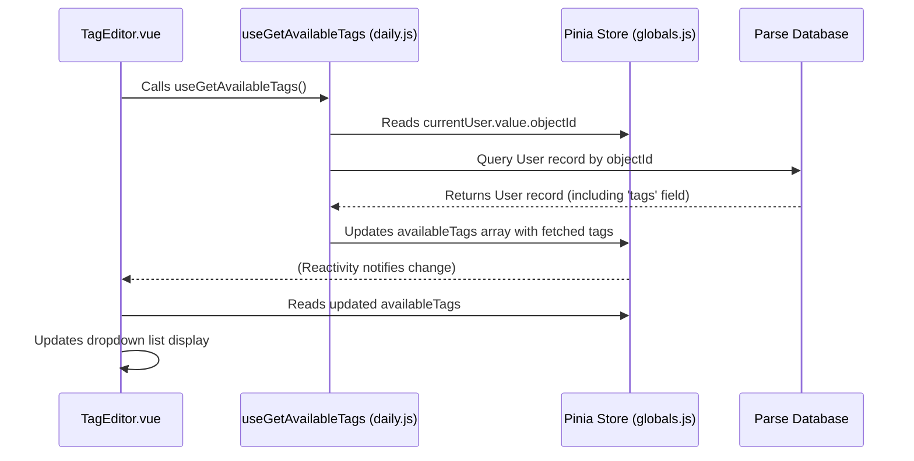

# Chapter 6: Application Utilities & Core Logic

In the previous chapter, [Chapter 5: Charting & Visualization (ECharts)](05_charting___visualization__echarts__.md), we saw how TradeNote turns processed data into insightful charts. We've covered data import, storage, processing, and visualization. But what holds everything together? What handles common tasks like formatting dates, showing popups, or talking to the backend database?

**What Problem Does This Solve?**

Imagine building something complex, like a house. You have specialists for plumbing, electricity, and painting (like our data processing and charting chapters). But you also need a collection of general tools – hammers, screwdrivers, measuring tapes, levels – and someone who knows how to use them for common tasks like hanging a picture or fixing a loose handle. You also need someone to handle the initial setup, like getting the building permits and connecting the main power.

In TradeNote, **Application Utilities & Core Logic** act as this **toolbox and utility belt**, along with the **initial setup crew**. It's a collection of helper functions and essential procedures used throughout the application. Instead of writing the same code over and over again in different components (like how to format a date or how to fetch diary entries), we put that code in a central place (our toolbox) so anyone (any component) can use it easily.

This solves several problems:
1.  **Keeps Code DRY (Don't Repeat Yourself):** Avoids writing the same logic multiple times.
2.  **Makes Code Cleaner:** Main components focus on their primary job, calling utility functions for common tasks.
3.  **Ensures Consistency:** Everyone uses the same tool (function) for the same job, leading to consistent results (e.g., all dates are formatted the same way).
4.  **Handles Essential Setup:** Takes care of initializing the application and managing core interactions.

**Core Concepts**

1.  **Utility Functions:** These are small, reusable functions designed to perform a specific, common task. Think of them as individual tools in the toolbox. Examples:
    *   Formatting a number as currency (`$1,234.56`).
    *   Formatting a Unix timestamp into a readable date (`03/15/2023`).
    *   Showing a tooltip when you hover over an element.
    *   Capitalizing the first letter of a word.
2.  **Core Logic Functions:** These are slightly larger functions that handle more complex, application-wide procedures. Think of them as specific procedures or services. Examples:
    *   **Initialization (`useInitParse`, `useCheckCurrentUser`):** Running essential setup tasks when the application starts, like connecting to the backend (Parse), checking if the user is logged in, and getting basic user settings like timezone.
    *   **Data Fetching/Updating (`useGetTags`, `useGetDiaries`, `useSaveScreenshot`, `useUpdateNote`):** Functions that interact with the backend database (Parse) to retrieve or save data related to features like tags, diaries, screenshots, notes, excursions, etc.
    *   **UI Management (`useInitPopover`, `useInitTooltip`, `useToggleMobileMenu`):** Functions that set up or manage interactive UI elements like popovers (small popup boxes), tooltips (hover text), or the mobile navigation menu.

These functions are mostly located in files within the `src/utils/` directory, such as `utils.js`, `daily.js`, `screenshots.js`, `diary.js`, `calendar.js`, and `playbooks.js`.

**How TradeNote Uses Utilities & Core Logic**

Let's see how these tools and procedures are used in practice.

**Example 1: Formatting a Number**

Imagine a component needs to display the total profit, which is stored as a simple number like `1572.3`. We want to show it nicely formatted as currency.

```vue
<!-- Simplified Dashboard Widget Component -->
<template>
  <div>
    <h3>Total Profit</h3>
    <!-- Call the utility function directly in the template -->
    <p>{{ useTwoDecCurrencyFormat(totalProfitValue) }}</p>
  </div>
</template>

<script setup>
import { ref } from 'vue';
// 1. Import the specific utility function we need
import { useTwoDecCurrencyFormat } from '@/utils/utils.js';

// Assume totalProfitValue is obtained from the store (Chapter 3)
const totalProfitValue = ref(1572.3);

// No complex logic needed here, the utility does the work!
</script>
```

*   `import { useTwoDecCurrencyFormat } from '@/utils/utils.js';`: We import the "currency formatting tool" from our toolbox (`utils.js`).
*   `{{ useTwoDecCurrencyFormat(totalProfitValue) }}`: We directly use the function in the template, passing the raw number. The function returns the formatted string `$1,572.30`.

**Example 2: Fetching Diary Entries**

When the user navigates to the Diary page, we need to fetch their diary entries from the backend.

```vue
<!-- Simplified Diary Page Component -->
<template>
  <div>
    <h2>My Diary Entries</h2>
    <div v-if="isLoading">Loading diaries...</div>
    <ul>
      <li v-for="entry in diaryEntries" :key="entry.objectId">
        {{ entry.date }}: {{ /* Display diary content */ }}
      </li>
    </ul>
  </div>
</template>

<script setup>
import { ref, onMounted } from 'vue';
// 1. Import the core logic function for fetching diaries
import { useGetDiaries } from '@/utils/diary.js';
// Import the reactive array where diaries are stored (from Chapter 3)
import { diaries as diaryEntries, spinnerLoadingPage as isLoading } from '@/stores/globals.js';

// 2. Call the function when the component is ready
onMounted(async () => {
  isLoading.value = true; // Show loading indicator
  try {
    // Fetch diaries for the 'diary' page context
    await useGetDiaries(true);
  } catch (error) {
    console.error("Failed to load diaries:", error);
    // Handle error display if needed
  } finally {
    isLoading.value = false; // Hide loading indicator
  }
});
</script>
```

*   `import { useGetDiaries } from '@/utils/diary.js';`: We import the procedure for fetching diaries.
*   `import { diaries as diaryEntries, ... } from '@/stores/globals.js';`: We also import the global state variable where the fetched diaries will be stored.
*   `onMounted(async () => { ... });`: This Vue hook runs when the component is first added to the page.
*   `await useGetDiaries(true);`: We call the imported function. This function handles talking to the backend (Parse), retrieving the data, and updating the `diaryEntries` array in the [Global State Management (Pinia Stores)](03_global_state_management__pinia_stores__.md). Because `diaryEntries` is reactive, the `v-for` loop in the template automatically updates to display the fetched entries.

**Example 3: Initializing the Application**

When you first load TradeNote, several things need to happen before you see anything useful. This is handled by initialization functions, often called very early when the application starts (see [Chapter 7: Vue Application Setup](07_vue_application_setup_.md)).

```javascript
// Simplified logic often found in main app setup (e.g., App.vue or main.js)
import { useInitParse, useCheckCurrentUser, useGetTimeZone } from '@/utils/utils.js';
import { currentUser } from '@/stores/globals.js';

async function initializeApp() {
  try {
    // 1. Connect to the backend (Parse)
    await useInitParse();

    // 2. Check if a user is already logged in
    await useCheckCurrentUser(); // This updates 'currentUser' in the store

    // 3. If logged in, get their timezone preference
    if (currentUser.value) {
      useGetTimeZone();
    }
    console.log("App initialized successfully!");
    // Now the app can proceed to load the main UI
  } catch (error) {
    console.error("App initialization failed:", error);
    // Maybe redirect to an error page or login
  }
}

initializeApp();
```

*   `useInitParse()`: Sets up the connection details for the Parse backend.
*   `useCheckCurrentUser()`: Checks browser storage for login credentials and fetches user details if found, storing them in the global `currentUser` state. It might also redirect to the login page if no user is found or to the dashboard if a user *is* found.
*   `useGetTimeZone()`: Reads the timezone setting from the fetched `currentUser` data and stores it globally.

**Internal Implementation: Under the Hood**

Let's look at how a simple utility function and a core logic function might work.

**Walkthrough: Fetching Available Tags (`useGetAvailableTags`)**

Imagine you open a modal window to tag a trade. The modal needs to show a dropdown list of all the tags you've created before. How does it get this list?

1.  **Component Needs Data:** The modal component (e.g., `TagEditor.vue`) realizes it needs the list of available tags.
2.  **Call Utility:** It calls the `useGetAvailableTags()` function imported from `src/utils/daily.js`.
3.  **Read Current User:** Inside `useGetAvailableTags()`, the function first needs to know *who* the current user is. It reads the `currentUser` object from the [Global State Management (Pinia Stores)](03_global_state_management__pinia_stores__.md).
4.  **Query Backend:** It constructs a query to the Parse backend: "Find the user record with the ID matching `currentUser.value.objectId`."
5.  **Fetch User Data:** It sends this query to Parse. Parse finds the user record in the database.
6.  **Extract Tags:** The function receives the full user record back from Parse. It specifically looks for a field named `tags` within that record, which contains the list of tag groups and tags the user has previously defined.
7.  **Store Update:** It takes this list of tags and updates the `availableTags` reactive array in the [Global State Management (Pinia Stores)](03_global_state_management__pinia_stores__.md).
8.  **Component Reacts:** The `TagEditor.vue` component, which is using the `availableTags` array from the store, automatically detects the change and updates its dropdown list to show the fetched tags.

**Sequence Diagram (Fetching Available Tags)**



**Code Structure Examples**

Let's peek at simplified versions of functions you might find in the `src/utils/` directory.

**1. Formatting Utility (`src/utils/utils.js`)**

This function takes a number and returns it formatted as USD currency with two decimal places.

```javascript
// src/utils/utils.js (Simplified Example)

/**
 * Formats a number into a two-decimal currency string (USD).
 * Example: 1234.567 -> $1,234.57
 * @param {number} param The number to format.
 * @returns {string} The formatted currency string.
 */
export function useTwoDecCurrencyFormat(param) {
  // Use built-in JavaScript Internationalization API
  return new Intl.NumberFormat("en-US", {
    maximumFractionDigits: 2, // Ensure two decimal places
    minimumFractionDigits: 2, // Ensure two decimal places even for whole numbers
    style: 'currency',
    currency: 'USD'
  }).format(param); // Apply formatting to the input number
}
```

*   This is a simple, pure function. It takes an input (`param`), performs a specific task (formatting), and returns an output. It relies on standard browser features (`Intl.NumberFormat`).

**2. Core Logic - Data Fetching (`src/utils/daily.js`)**

This function fetches the list of available tags for the current user from the Parse backend.

```javascript
// src/utils/daily.js (Simplified Example)
import Parse from 'parse/dist/parse.min.js';
// Import state from the global store (Chapter 3)
import { currentUser, availableTags } from "../stores/globals.js";

/**
 * Fetches the available tags defined by the current user from Parse.
 * Updates the 'availableTags' array in the global store.
 */
export async function useGetAvailableTags() {
  return new Promise(async (resolve, reject) => {
    console.log(" -> Getting Available Tags");
    availableTags.length = 0; // Clear the existing list first

    try {
      // 1. Define the Parse object type ("_User") and create a query
      const parseObject = Parse.Object.extend("_User");
      const query = new Parse.Query(parseObject);

      // 2. Specify which user to fetch (the currently logged-in one)
      query.equalTo("objectId", currentUser.value.objectId);

      // 3. Execute the query (fetch the first matching record)
      const userRecord = await query.first();

      if (userRecord) {
        // 4. Get the 'tags' field from the user record
        const userTags = userRecord.get('tags'); // Parse method to get field value

        // 5. If tags exist, update the global store array
        if (userTags && userTags.length > 0) {
          userTags.forEach(tagGroup => availableTags.push(tagGroup));
        }
        console.log("  --> Available Tags updated:", availableTags);
        resolve(); // Signal success
      } else {
        console.warn("Could not find user record.");
        reject("User not found"); // Signal failure
      }
    } catch (error) {
      console.error("Error fetching available tags:", error);
      reject(error); // Signal failure
    }
  });
}
```

*   This function is more complex as it involves asynchronous operations (`async`/`await`) and interaction with the Parse backend.
*   It reads `currentUser` from the store to know who to query for.
*   It uses the Parse SDK (`Parse.Query`, `query.equalTo`, `query.first`, `userRecord.get`) to talk to the database.
*   It updates the `availableTags` array in the global store, making the fetched data available to the rest of the application reactively.

**3. Core Logic - UI Management (`src/utils/utils.js`)**

This function toggles the visibility of the mobile side menu.

```javascript
// src/utils/utils.js (Simplified Example)
// Import state from the global store (Chapter 3)
import { sideMenuMobileOut } from "../stores/globals.js";

/**
 * Toggles the visibility of the mobile side navigation menu.
 * Updates the 'sideMenuMobileOut' state in the global store and
 * applies/removes a CSS class to the menu element.
 */
export function useToggleMobileMenu() {
  // 1. Find the menu element in the HTML document
  let element = document.getElementById("sideMenu");

  if (element) {
    // 2. Toggle a CSS class on the element to show/hide it
    // (The actual show/hide logic is handled by CSS rules for '.toggleSideMenu')
    element.classList.toggle("toggleSideMenu");

    // 3. Update the global state variable to reflect the new visibility state
    sideMenuMobileOut.value = !sideMenuMobileOut.value;

    console.log("Mobile menu toggled. Visible:", sideMenuMobileOut.value);
  } else {
    console.error("Could not find side menu element with ID 'sideMenu'.");
  }
}
```

*   This function directly interacts with the web page's structure (the DOM) using `document.getElementById` and `element.classList.toggle`.
*   It also updates a global state variable (`sideMenuMobileOut`) to keep track of whether the menu is currently open or closed, which other parts of the app might use.

**Conclusion**

You've now learned about the "toolbox" and "utility belt" of TradeNote – the **Application Utilities & Core Logic**.

*   You understand **why** they are needed: to avoid repetition, keep code clean, ensure consistency, and handle essential tasks.
*   You know the concepts: **Utility Functions** (small tools like formatters) and **Core Logic Functions** (bigger procedures like data fetching or initialization).
*   You've seen examples of how components **use** these functions (e.g., calling `useTwoDecCurrencyFormat` or `useGetDiaries`).
*   You understand that these functions often live in the **`src/utils/`** directory.
*   You've seen simplified examples of how these functions work internally, sometimes interacting with the global store (Chapter 3) or the backend (Parse).

These utilities form the backbone of the application, providing reusable tools and essential services that make the development of features like charting, data display, and user interaction much smoother and more organized.

We've now covered most of the core *internal* parts of TradeNote. But how is the Vue application itself set up? How does it all start running? That's what we'll explore next.

**Next Chapter:** [Chapter 7: Vue Application Setup](07_vue_application_setup_.md)

---

Generated by [AI Codebase Knowledge Builder](https://github.com/The-Pocket/Tutorial-Codebase-Knowledge)