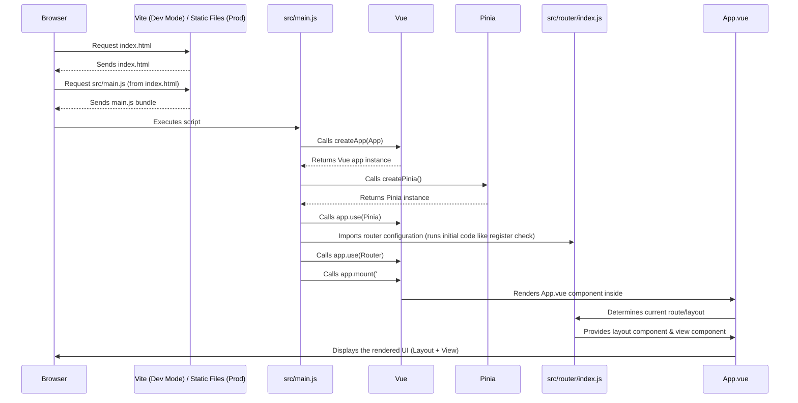

# Chapter 7: Vue Application Setup

Welcome to Chapter 7! In [Chapter 6: Application Utilities & Core Logic](06_application_utilities___core_logic_.md), we looked at the helpful tools and essential background tasks that keep TradeNote running smoothly. We've explored data import, storage, processing, charting, and utilities. But how does the whole application actually *start*? What's the very first step that kicks everything off in your browser?

**What Problem Does This Solve?**

Imagine you've just received all the parts needed to build a fancy electronic device – the screen, the buttons, the circuit boards, the power supply. You can't just throw them in a box and expect them to work! You need a main instruction manual and a central point (like a mainboard) to connect everything correctly, power it up, and tell it what to do first.

Similarly, our TradeNote application is made of many parts:
*   Vue components (the visual pieces like buttons and charts).
*   The router ([Chapter 1: Routing and Layouts](01_routing_and_layouts_.md)) that handles navigation.
*   The Pinia store ([Chapter 3: Global State Management (Pinia Stores)](03_global_state_management__pinia_stores__.md)) that holds shared data.
*   Various utility functions ([Chapter 6: Application Utilities & Core Logic](06_application_utilities___core_logic_.md)).

How do all these pieces get assembled, connected, and started when you open TradeNote in your browser? That's the job of the **Vue Application Setup**. It's like the **master switchboard and startup sequence** for the user interface. It ensures the core Vue framework is running, connects essential plugins like the router and state management, and tells the browser what to display first.

**Core Concepts**

1.  **`src/main.js` (Entry Point):** This is the *very first* JavaScript file that the browser runs for the TradeNote application. Think of it as the **ignition key** for the app. It starts the entire process.
2.  **Vue App Instance (`createApp`):** This is the command in `main.js` that creates the main, central Vue application object. It's like turning the key and starting the **engine** of the app.
3.  **Plugins (`app.use(...)`):** These are add-ons that give the Vue app extra powers. In TradeNote, we "plug in":
    *   **Pinia:** The state management library ([Chapter 3: Global State Management (Pinia Stores)](03_global_state_management__pinia_stores__.md)). This connects the app's "dashboard gauges" (shared data).
    *   **Vue Router:** The navigation library ([Chapter 1: Routing and Layouts](01_routing_and_layouts_.md)). This connects the app's "GPS system".
4.  **Root Component (`App.vue`):** This is the main, top-level Vue component that acts as the container for the *entire* user interface. It's like the **chassis and body** of the car, holding everything else inside it. `main.js` tells Vue to use `App.vue` as this main container.
5.  **Mounting (`app.mount('#app')`):** This is the final step in `main.js`. It tells the Vue app instance to take control of a specific part of the HTML page (the element with `id="app"` in the main `index.html` file) and display the Root Component (`App.vue`) inside it. It's like putting the assembled car onto the road.
6.  **Vite (`vite.config.js`):** This is a modern **build tool**. While not directly part of the *running* application setup, it plays a crucial role *before* that. Vite takes all our Vue components, JavaScript files, CSS styles, etc., and efficiently bundles them together into optimized files that the browser can understand and run quickly. It's like the **factory** that assembles all the car parts before you even get the key. It also handles things like shortcuts (like using `@` to refer to the `src` folder).

**How TradeNote Sets Up the Application**

The setup process follows a clear sequence, mostly defined in `src/main.js`.

1.  **Start:** Your browser loads the `index.html` file, which includes a link to the main JavaScript bundle created by Vite. The execution starts with `src/main.js`.
2.  **Import Core Parts:** `main.js` imports necessary tools: `createApp` from Vue itself, `createPinia` for state management, our `App.vue` root component, and the `router` configuration from `src/router/index.js`.
3.  **Create Vue Engine:** `const app = createApp(App)` creates the main Vue application instance, telling it that `App.vue` is the root component.
4.  **Install Plugins:**
    *   `app.use(createPinia())`: Initializes Pinia and makes the global store ([Chapter 3: Global State Management (Pinia Stores)](03_global_state_management__pinia_stores__.md)) available throughout the application.
    *   `app.use(router)`: Installs the Vue Router ([Chapter 1: Routing and Layouts](01_routing_and_layouts_.md)), enabling navigation based on the routes defined in `src/router/index.js`.
5.  **Mount to HTML:** `app.mount('#app')` connects the Vue application instance to the `<div id="app"></div>` element in the `index.html` file. From this point, Vue takes control of this part of the webpage.
6.  **Display Root Component:** Vue renders the `App.vue` component inside the `#app` div. `App.vue` then uses the router to determine the correct layout and view to display based on the current URL.

**Internal Implementation: Under the Hood**

Let's trace the startup sequence when you load TradeNote.

**Step-by-Step Walkthrough**

1.  **Browser Request:** You navigate to the TradeNote URL. The server sends back `index.html`.
2.  **HTML Parse:** The browser reads `index.html`. It finds a `<script type="module" src="/src/main.js"></script>` tag (or similar, pointing to the Vite-processed entry point).
3.  **`main.js` Execution:** The browser downloads and runs the `main.js` script.
4.  **Imports:** The script imports `createApp`, `App`, `createPinia`, and `router`. *Note: Importing `router` from `src/router/index.js` might trigger some initial logic within that file, like the check for `registerOff` which talks to the backend even before Vue fully mounts!*
5.  **Vue Instance Creation:** `createApp(App)` builds the core Vue application object, linked to `App.vue`.
6.  **Pinia Setup:** `app.use(createPinia())` sets up the Pinia plugin for global state.
7.  **Router Setup:** `app.use(router)` sets up the Vue Router plugin, making `<router-link>` and `<router-view>` components available and activating the navigation guards.
8.  **Mounting:** `app.mount('#app')` tells Vue to render its content within the `<div id="app"></div>` found in `index.html`.
9.  **`App.vue` Rendering:** Vue renders the `App.vue` component.
10. **Layout & View Rendering:** `App.vue` typically contains logic to display the correct layout (based on the current route's `meta.layout` from [Chapter 1: Routing and Layouts](01_routing_and_layouts_.md)) and a `<router-view>` tag. Vue Router uses the `<router-view>` to render the specific view component (like `Dashboard.vue` or `Login.vue`) corresponding to the current URL path.
11. **Display:** The complete user interface appears in your browser.

**Sequence Diagram**



**Code Dive**

Let's look at the key files involved.

**1. `src/main.js` (The Ignition)**

This file orchestrates the startup.

```javascript
// Import the main function to create a Vue app
import { createApp } from 'vue'
// Import the function to create the Pinia store instance
import { createPinia } from 'pinia'

// Import the root Vue component (the main container)
import App from './App.vue'
// Import the router configuration (handles navigation)
import router from './router'

// Import the main CSS file
import './assets/style-dark.css'

// 1. Create the Vue application instance, using App.vue as the root
const app = createApp(App)

// 2. Install the Pinia plugin for state management
app.use(createPinia())
// 3. Install the Vue Router plugin for navigation
app.use(router)

// 4. Mount the application to the HTML element with id="app"
app.mount('#app')
```

*   This code is quite straightforward: import necessary parts, create the app, add the Pinia and Router plugins, and mount the app to the HTML.

**2. `src/App.vue` (The Chassis)**

This is the top-level component. It uses the router to figure out which layout to use.

```vue
<template>
  <!-- Dynamically loads the correct layout component -->
  <component :is="layout">
    <!-- RouterView is where the actual page component (View) will be displayed -->
    <router-view />
  </component>
</template>

<script setup>
import { computed } from 'vue';
import { useRoute } from 'vue-router';
// Import the default layout (if needed, sometimes defined here or imported)
// import DefaultLayout from './layouts/Default.vue';

const route = useRoute();

// Determine which layout to use based on the current route's meta information
const layout = computed(() => {
  // Get layout from route meta, or use a default if none specified
  // (Note: TradeNote defines layouts directly in router/index.js meta)
  return route.meta.layout // || DefaultLayout;
});
</script>
```

*   `useRoute()`: Gets information about the current route (URL, meta fields, etc.).
*   `computed(() => route.meta.layout)`: This looks at the `meta.layout` property we defined for each route in `src/router/index.js` (see [Chapter 1: Routing and Layouts](01_routing_and_layouts_.md)).
*   `<component :is="layout">`: This is a special Vue tag that renders a component dynamically. It renders whichever layout component (`DashboardLayout.vue`, `LoginRegisterLayout.vue`, etc.) is returned by the `layout` computed property.
*   `<router-view />`: This is where Vue Router injects the main content component (the "View" like `Dashboard.vue` or `Settings.vue`) that matches the current URL path.

**3. `vite.config.js` (The Factory Setup)**

This file configures the Vite build tool.

```javascript
// Import necessary functions from Vite and Node.js
import { fileURLToPath, URL } from 'node:url'
import { defineConfig } from 'vite'
import vue from '@vitejs/plugin-vue' // The plugin to handle .vue files

// Export the configuration object
export default defineConfig({
  // List of plugins Vite should use
  plugins: [vue()], // Add the Vue plugin
  // Configure how Vite resolves module paths
  resolve: {
    // Set up path aliases for cleaner imports
    alias: {
      // Allows us to write `import ... from '@/components/...'`
      // instead of `import ... from './src/components/...'`
      '@': fileURLToPath(new URL('./src', import.meta.url))
    }
  }
})
```

*   `plugins: [vue()]`: Tells Vite to use the official Vue plugin, which knows how to process `.vue` files (Single File Components).
*   `resolve.alias`: Sets up a handy shortcut. `@` is now an alias for the `src` directory, making imports cleaner (e.g., `import { currentUser } from '@/stores/globals.js';`).

**4. `src/router/index.js` (Early Checks)**

Remember from [Chapter 1: Routing and Layouts](01_routing_and_layouts_.md) that the router setup can include code that runs very early.

```javascript
// src/router/index.js (Snippet - Initial Check)
import { registerOff } from '../stores/globals'
import axios from 'axios'

// This IIFE (Immediately Invoked Function Expression) runs when this file is imported
;(async () => {
  async function getRegisterPage() {
    // ... (axios call to /api/registerPage) ...
    // This updates 'registerOff' in the Pinia store
    registerOff.value = response.data
    // ...
  }
  // This check happens *before* app.mount() in main.js!
  await getRegisterPage()
})()

// ... rest of router setup (createRouter, routes, beforeEach) ...

const router = createRouter({ /* ... */ })

// Navigation guard using the value fetched above
router.beforeEach((to, from, next) => {
  // ... set document title ...
  // Check the value set by the initial API call
  if (to.name === 'register' && registerOff.value) {
    next('/') // Redirect if registration is off
  } else {
    next()
  }
})

export default router
```

*   The `(async () => { ... })();` block runs as soon as `src/router/index.js` is imported by `src/main.js`.
*   This shows that some application setup, like checking server configurations (is registration allowed?), can happen even *before* the main Vue application is fully mounted and visible. The result (`registerOff.value`) is stored in Pinia and used later by the navigation guard.

**Conclusion**

You've now seen how the TradeNote frontend application comes to life!

*   You understand that **`src/main.js`** is the crucial entry point or "ignition key".
*   You learned how it uses **`createApp`** to initialize Vue with the root **`App.vue`** component.
*   You saw how essential **plugins** like **Pinia** (state management) and **Vue Router** (navigation) are added using `app.use()`.
*   You know that **`app.mount('#app')`** connects the Vue app to the HTML page.
*   You understand the role of **Vite** as the build tool that prepares everything for the browser and provides conveniences like path aliases (`@`).
*   You saw that setup can involve early checks, even before the UI is fully visible.

This setup process ensures all the different parts of TradeNote – components, state, navigation – are correctly wired together and ready to provide you with a smooth user experience.

We've covered the frontend application structure extensively. But how is the *entire* project, including the backend database and potentially other services, managed and run together easily? That's where Docker comes in.

**Next Chapter:** [Chapter 8: Docker Orchestration](08_docker_orchestration_.md)

---

Generated by [AI Codebase Knowledge Builder](https://github.com/The-Pocket/Tutorial-Codebase-Knowledge)