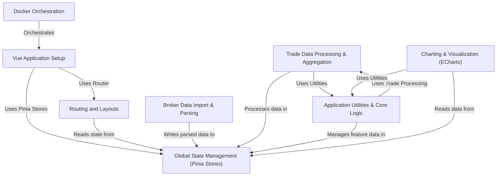

# Tutorial: TradeNote

TradeNote is an *open-source trading journal* designed for traders who value **data security and privacy**.
It helps you import trade data from various brokers, analyze your performance using charts and metrics, and discover patterns in your trading through features like diaries, screenshots, and playbooks.
The goal is to provide a **simple yet flexible** tool to help traders become more consistent and profitable.

**Source Repository:** [None](None)

## Chapters

1. [Routing and Layouts
](01_routing_and_layouts_.md)
2. [Broker Data Import & Parsing
](02_broker_data_import___parsing_.md)
3. [Global State Management (Pinia Stores)
](03_global_state_management__pinia_stores__.md)
4. [Trade Data Processing & Aggregation
](04_trade_data_processing___aggregation_.md)
5. [Charting & Visualization (ECharts)
](05_charting___visualization__echarts__.md)
6. [Application Utilities & Core Logic
](06_application_utilities___core_logic_.md)
7. [Vue Application Setup
](07_vue_application_setup_.md)
8. [Docker Orchestration
](08_docker_orchestration_.md)

---

Generated by [AI Codebase Knowledge Builder](https://github.com/The-Pocket/Tutorial-Codebase-Knowledge)